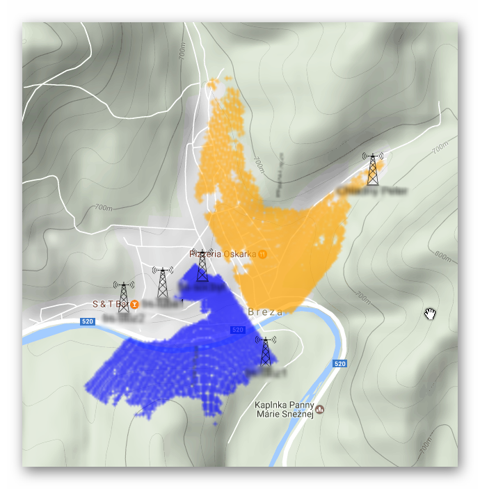

# world elevations reader


## EXAMLE
#### PHP
```php
$lat = 49.386287689;
$lon = 19.3770275116;
$hgtPath = "path/to/hgt"
HgtReader::init($hgtPath,3);
$el = HgtReader::getElevation($lat,$lon);
echo "elevation on {$lat},{$lon} is {$el}m";
```
#### Go
```go
var lat = 49.386287689
var lon = 19.3770275116
var hgtPath = "path/to/hgt"
hgtReader, err := New(hgtPath,3)
defer hgtReader.Close()
el, err := hgtReader.GetElevation(lat,lon)
fmt.Println(el)
```


you can download htg files [from here](http://www.viewfinderpanoramas.org/Coverage%20map%20viewfinderpanoramas_org3.htm)

### Purpose



