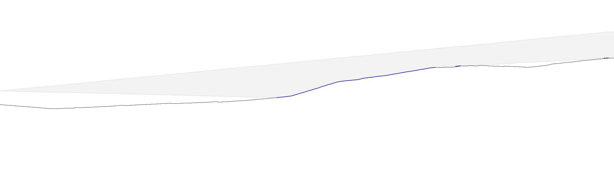
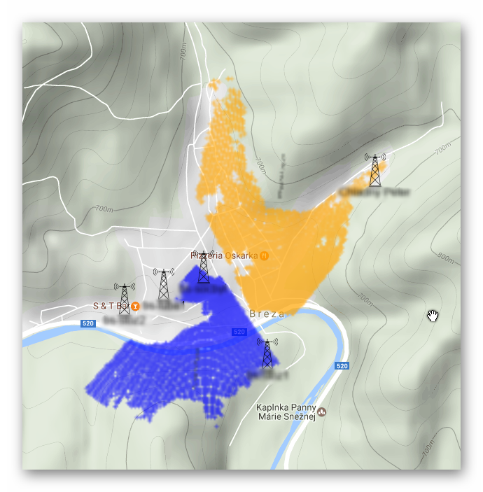

# HGT Elevation Reader

[](https://github.com/tito10047/hgtreader/actions/workflows/php-tests.yml)
[](LICENSE)

Professional PHP library for reading SRTM (HGT) files with high precision and minimal memory footprint. Designed for modern PHP 8.2+ with an emphasis on SOLID principles and flexibility.

## 🚀 Key Features

- **Extremely low memory footprint**: Uses `fseek` for direct data access without loading entire files into RAM.
- **High precision**: Implements bilinear interpolation for accurate elevation calculation between measurement points.
- **Flexible architecture**: Abstraction of data sources (DataSource) and tile providers (TileProvider).
- **Resolution support**: Full support for both SRTM-1 (1 arc-second) and SRTM-3 (3 arc-seconds).

## 📦 Installation

You can install the library via Composer:

```bash
composer require tito10047/hgtreader
```

## 🛠️ Quick Start (Modern API)

```php
use Tito10047\HgtReader\HgtReader;
use Tito10047\HgtReader\Resolution;
use Tito10047\HgtReader\TileProvider\LocalFileSystemTileProvider;

// 1. Set the path to the folder containing .hgt files
$hgtPath = __DIR__ . '/data/hgt';

// 2. Create a tile provider (TileProvider)
$provider = new LocalFileSystemTileProvider($hgtPath);

// 3. Initialize the reader (Resolution is auto-detected from file size)
$reader = new HgtReader($provider);

// 4. Get precise elevation for coordinates
$lat = 49.38628;
$lon = 19.37702;
$elevation = $reader->getElevation($lat, $lon);

echo "Elevation: {$elevation} m";
```

## 🖼️ Purpose and Usage

The library is ideal for generating elevation profiles of tracks, terrain analysis, or visualizing geographical data.


*Example of track elevation profile rendering.*


*Detailed visualization of terrain changes.*

## 🧩 Advanced Features

### Custom DataSources

If you need to read data from memory (e.g., during network transfers), you can use `MemoryDataSource`:

```php
use Tito10047\HgtReader\DataSource\MemoryDataSource;
// ...
$content = file_get_contents('path/to/file.hgt');
$dataSource = new MemoryDataSource($content);
```

### SRTM-1 Support

For more detailed data (3601x3601 points), simply change the resolution:

```php
$reader = new HgtReader($provider, Resolution::Arc1);
```

## 👴 Legacy Support (Backward Compatibility)

The original static interface is available for existing projects:

```php
// The old way of calling is still functional via a wrapper
HgtReader::init(__DIR__ . '/data/hgt', 3); // 3 for SRTM-3
$elevation = HgtReader::getElevation(49.38, 19.37);
```

## 📂 Where to download HGT data?

You can obtain data in .hgt format from various sources, for example:
- [Viewfinder Panoramas](http://www.viewfinderpanoramas.org/Coverage%20map%20viewfinderpanoramas_org3.htm)
- [NASA Earthdata (SRTM)](https://earthdata.nasa.gov/)

## 🧪 Testing

The project is fully covered by tests using PHPUnit:

```bash
./vendor/bin/phpunit tests
```

## 📄 License

This project is licensed under the Apache-2.0 License - see the `LICENSE` file for details.

---
Author: [Jozef Môstka](mailto:jozef@mostka.com)
